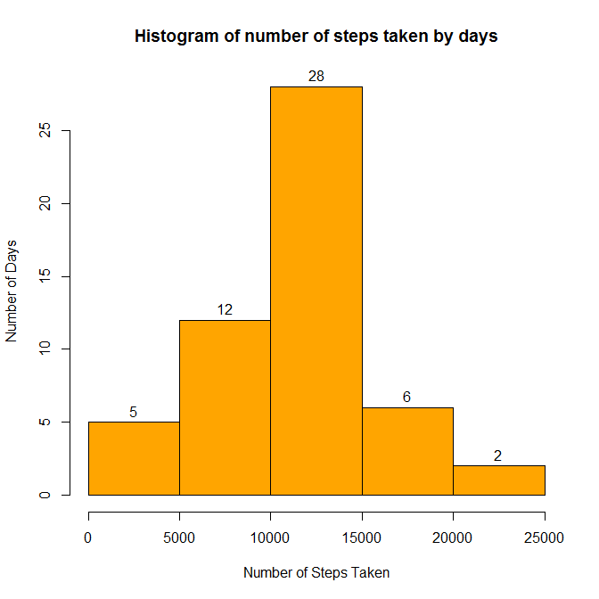
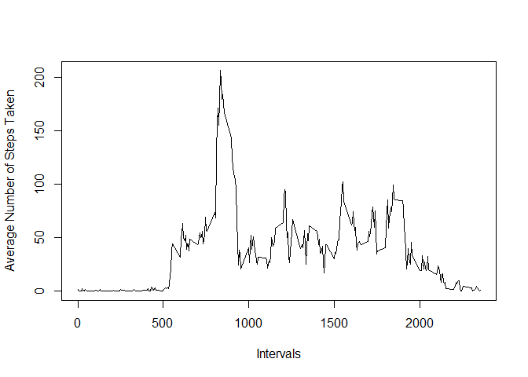

# Reproducible Research: Peer Assessment 1

Before starting we have to load some libraries neccessary for next work. Also, we set a name of directory, in which our dataset is.

```r
library(dplyr)
```

```
## 
## Attaching package: 'dplyr'
## 
## The following object is masked from 'package:stats':
## 
##     filter
## 
## The following objects are masked from 'package:base':
## 
##     intersect, setdiff, setequal, union
```

```r
library(lattice)
filename <- "activity.zip"
```


## Loading and preprocessing the data

```r
data <- read.csv(unz(filename, "activity.csv"),
                 header=TRUE,
                 colClasses=c("numeric","Date","numeric"))

data <- tbl_df(data)

with.NAs <- data
without.NAs <- filter(data,
                      !is.na(steps))
```


## What is mean total number of steps taken per day?

```r
# we must group data by date
data.1 <- group_by(without.NAs,
                   date)

# the next step is adding new variable, which contains sum of steps by days
data.1 <- mutate(data.1,
                 steps.by.days=sum(steps))

# we want unique days, because each day with one date has the same sum of steps  
data.1 <- distinct(data.1,
                   date)

# finally, we can draw a histogram
hist(data.1$steps.by.days,
     xlab="Number of Steps Taken",
     ylab="Number of Days",
     main="Histogram of number of steps taken by days",
     labels=TRUE,
     col="orange")
```

 

```r
data1.mean <- mean(data.1$steps.by.days)
data1.median <- median(data.1$steps.by.days)
```
Mean total number of steps taken per day is 1.0766189\times 10^{4}, while the median has value of 1.0765\times 10^{4}.


## What is the average daily activity pattern?

```r
# we must group data by intervals
data.2 <- group_by(without.NAs,
                   interval)

# the next step is adding new variable, which contains average of steps by intervals
data.2 <- mutate(data.2,
                 average.steps.by.intervals=sum(steps)/n())

# we want unique inervals, because each interval with the same number has the same average of steps  
data.2 <- distinct(data.2,
                   interval)

# finally, we can draw a plot
with(data.2, plot(interval,
                  average.steps.by.intervals,
                  type="l",
                  xlab="Intervals",
                  ylab="Average Number of Steps Taken"))
```

 

```r
# we must ungroup the data so that we can find interval with maximal average steps taken
data.2 <- ungroup(data.2)

# now we can find needed interval
maximum.number.of.steps <- filter(data.2,
                                  average.steps.by.intervals==max(average.steps.by.intervals))$interval
```
Interval **835** contains the maximum number of steps, on average across all the days in the dataset.


## Imputing missing values

```r
sum.of.NAs <- sum(is.na(with.NAs))
```
The total number of missing values in the dataset (i.e. the total number of rows with `NA`s) is **2304**.

In the next code chunk we firstly group data by inervals (including rows with `NA`s). That is made because we are going to replace all `NA`s with mean number of steps taken in each interval.

```r
data.3 <- group_by(with.NAs, interval)
```

So after grouping the data is done, we add a variable called inerval.mean, which contains mean number of steps taken for each interval separately.

```r
data.3 <- mutate(data.3, interval.mean=mean(steps, na.rm=TRUE))
```

The last step is done with ease of `ifelse` statement, which allows us to simply replace `NA`s with mean number of steps for current interval, or to let there original number of steps.

```r
data.3 <- mutate(data.3, steps=ifelse(is.na(steps), interval.mean, steps))
data.3 <- select(data.3, steps, date, interval)
data.3
```

```
## Source: local data frame [17,568 x 3]
## Groups: interval
## 
##        steps       date interval
## 1  1.7169811 2012-10-01        0
## 2  0.3396226 2012-10-01        5
## 3  0.1320755 2012-10-01       10
## 4  0.1509434 2012-10-01       15
## 5  0.0754717 2012-10-01       20
## 6  2.0943396 2012-10-01       25
## 7  0.5283019 2012-10-01       30
## 8  0.8679245 2012-10-01       35
## 9  0.0000000 2012-10-01       40
## 10 1.4716981 2012-10-01       45
## ..       ...        ...      ...
```


```r
# data.3 <- ungroup(data.3)
# 
# data.3 <- group_by(data.3,
#                    date)
# 
# data.3 <- mutate(data.3,
#                  steps.by.days=sum(new.steps))
# 
# data.3 <- distinct(data.3,
#                    date)
# 
# hist(data.3$steps.by.days,
#      xlab="Number of Steps Taken",
#      ylab="Number of Days",
#      main="Histogram of number of steps taken by days",
#      labels=TRUE,
#      col="orange")
# 
# data3.mean <- mean(data.3$steps.by.days)
# data3.median <- median(data.3$steps.by.days)Mean total number of steps taken per day with `NA`s replaced is `r data3.mean`, while the median has value of `r data3.median`.
```


## Are there differences in activity patterns between weekdays and weekends?
In this part we have got one restriction, which is to use the dataset made few steps before, where all `NA`s were replaced.

```r
# we simply add a variable containing type of the current day
data.4 <- mutate(without.NAs,
                 day.type=ifelse(weekdays(date) %in% c('sobota','nedela'),'weekend','weekday'))

# we must group data by intervals and by date.type simultaneously
data.4 <- group_by(data.4,
                   interval,
                   day.type)

data.4 <- mutate(data.4,
                 average.steps.by.day.type=sum(steps)/n())


data.4 <- distinct(data.4,
                   interval,
                   day.type)


xyplot(average.steps.by.day.type ~ interval | day.type,
       data=data.4,
       xlab="Intervals",
       ylab="Average Number of Steps Taken",
       layout=c(1,2),
       type="l")
```

 

```r
data.4 <- ungroup(data.4)

filter(data.4,
       average.steps.by.day.type==max(average.steps.by.day.type))
```

```
## Source: local data frame [1 x 5]
## 
##   steps       date interval day.type average.steps.by.day.type
## 1   173 2012-10-06      915  weekend                  276.1429
```
